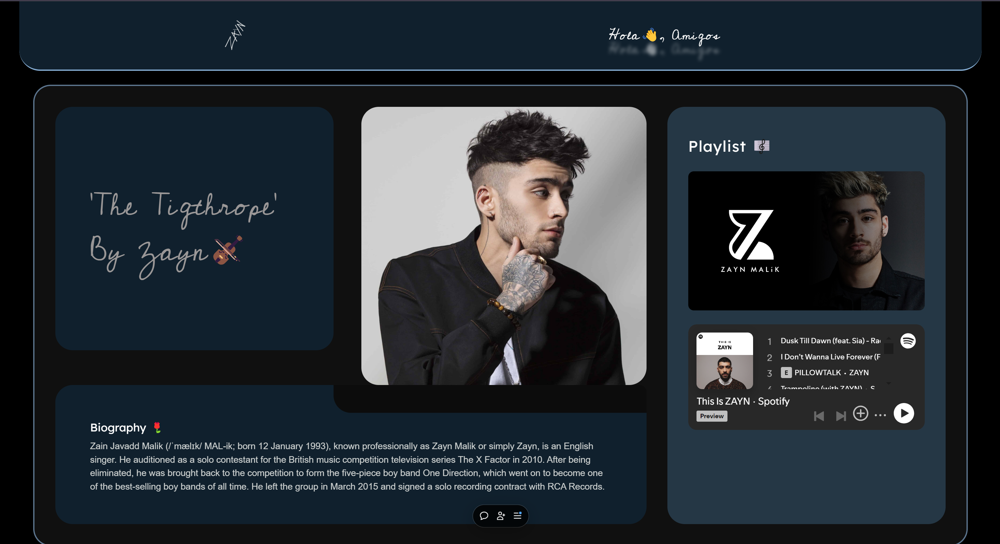
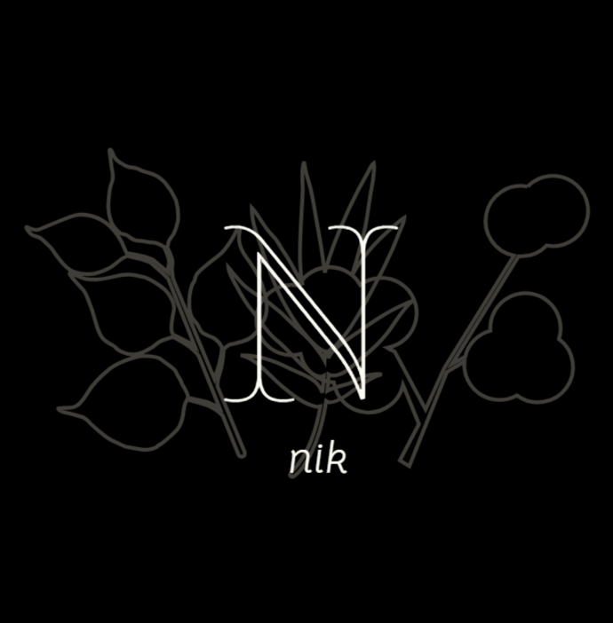

# https://modern-ui-portfolio-concept-g3nqm5jbi-nikhilkumar2001s-projects.vercel.app/

# Modern UI Portfolio Concept🚀

I have designed a modern UI concept portfolio inspired from https://www.figma.com/community/file/1408441048826723944/bentolio for my favorite singer, Zayn Malik. This project is built using Vite, React.js, and Remix, showcasing my design and development skills while celebrating Zayn's musical artistry.

## Features🔥

- Elegant Design: Crafted in Figma, the portfolio features a sleek and responsive layout that highlights Zayn's work.
- Spotify Integration: Users can enjoy Zayn Malik's music through an embedded Spotify playlist, creating an immersive experience.
- Libraries Used:-
    - Vite.js for fast and efficient development
    - Tailwind CSS for stylish and responsive designs
   - Remix for web framework
   - React Router for smooth navigation
   - Aos (npm package)


## Deployment🖥️
This is an example of how you may give instructions on setting up your project locally. To get a local copy up and running follow these simple example steps.

To run this project run
```bash
  npm i
```
```bash
  npm i remix
```
```bash
  npm run dev
```
## Ownership

